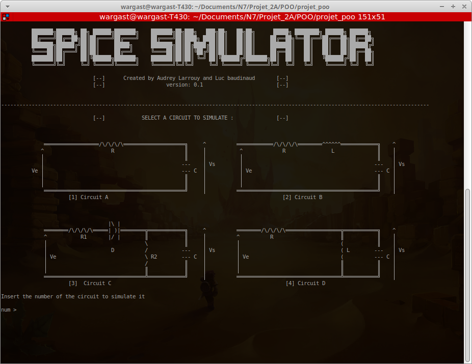

# Spice Simulator

<p align="center"></p>

Ce projet consiste à simuler différents circuits électriques à l'aide de plusieurs méthodes de résolution : 
  - Euler
  - Heun
  - Range-Kutta ordre 4

Pour cela, plusieurs sources sont disponibles (Sinusoïde, échelon, carrée, triangulaire).

Ce programme utilise la bibliothèque Eigen. Si vous vouler modifier ou recompiler le programme, il vous faudra le spécifier au compilateur. La bibliothèque est fournie dans le repositorie, il suffit de copier ce dossier dans le répertoire dédier du compilateur. Sinon, les sriptes de compilation fournis sont préconfigurer pour utiliser cette bibliothèque.

Le site officiel de Eigen : <http://eigen.tuxfamily.org/index.php?title=Main_Page>.

## Setup
###   Sous linux 
#### Utilisation

Ouvrez un terminal dans le dossier et lancer l'executable `launcher`. 
```shell
./launcher
```
Suivez les instructions puis terminer la simulation.
Pour tracez les résultats, vous pouvez utiliser le scipt python nommé `trace.py` 
```shell
python trace.py
```
#### Compilation
Pour compiler, aucun fichier Makefile n'a encpore été fait. Utiliser la commande suivante ou le script bash `complile.sh` pour le faire. attention s'il des fichiers sources sont ajouter il faudra aussi les rajouter en argument de la commande.
```shell
g++ -o launcher  main2.cpp source/Source.cpp  source/aperiodique.cpp source/periodique.cpp source/creneau.cpp source/echelon.cpp source/rectang.cpp source/sinus.cpp source/triang.cpp EDP/EDP.cpp EDP/EDP1.cpp EDP/exemple1.cpp EDP/circuit.cpp EDP/RC.cpp EDP/RCD.cpp EDP/EDP_2.cpp EDP/exemple2.cpp EDP/circuit2.cpp EDP/RLC.cpp EDP/RLCparallel.cpp
````
ou
``` shell
./compile.sh
```


###   Sous Windows
#### Utilisation
Il suffit de lancer l'executable nommé `laucher.exe`. Cela derait ouvrir un terminal et lancez le programme.
Pour tracer vos résultats, vous pouvez utiliser le script python. Un fichier Batch `trace.bat` a été créé pour faciliter la tache.  

#### Compilation 
Pour facilité la compilation (et comme aucun fichier Makefile n'a encore été fait) le fichier Batch `compile.bat` contient la commande à lancer. Sinon lancez dans un cmd.exe ou dans un PowerShell :

```shell
g++ -o launcher  main2.cpp source/Source.cpp  source/aperiodique.cpp source/periodique.cpp source/creneau.cpp source/echelon.cpp source/rectang.cpp source/sinus.cpp source/triang.cpp EDP/EDP.cpp EDP/EDP1.cpp EDP/exemple1.cpp EDP/circuit.cpp EDP/RC.cpp EDP/RCD.cpp EDP/EDP_2.cpp EDP/exemple2.cpp EDP/circuit2.cpp EDP/RLC.cpp EDP/RLCparallel.cpp
```
